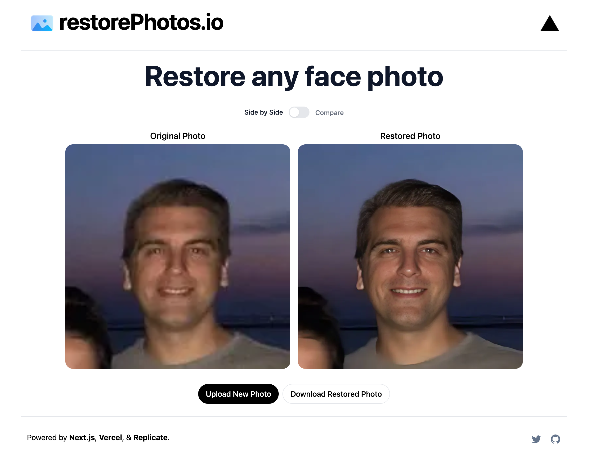

# [RestorePhotos.io](https://restorephotos.io/)

Proyek ini mengembalikan foto wajah lama menggunakan AI. Tonton [video penjelasan 4 menit](https://twitter.com/nutlope/status/1614794731396931585) untuk melihat bagaimana saya membuat ini atau lihat [demo 15 detik](https://twitter.com/nutlope/status/1612488923716136962).

[](https://restorephotos.io/)

## Bagaiman Ini Bekerja

Ini menggunakan model ML dari Applied Research Center yang disebut [GFPGAN](https://github.com/TencentARC/GFPGAN) di [Replicate](https://replicate.com/) untuk memulihkan foto wajah. Aplikasi ini memberi Anda kemampuan untuk mengunggah foto apa pun, yang akan mengirimkannya melalui Model ML ini menggunakan rute Next.js API, dan mengembalikan foto Anda yang dipulihkan.

## Berjalan secara lokal

Catatan: Saya baru saja menambahkan autentikasi sehingga langkah-langkah ini belum selesai seperti sekarang. Anda dapat menggandakan git dari [komit khusus ini](https://github.com/Nutlope/restorePhotos/tree/1c5c8ac4f52a08f68a3091d3b21be8a65aef71f2).

### Kloning Repository Ke Mesin Lokal

```bash
git clone
```

### Membuat akun di Replicate untuk mendapatkan kunci API.

1. Buka [Replikasi](https://replicate.com/) untuk membuat akun.
2. Klik foto profil Anda di pojok kanan atas, dan klik "Dasbor".
3. Klik "Akun" di bilah navigasi. Dan, di sini Anda dapat menemukan token API Anda, salin.

### Menyimpan kunci API di file .env.

Buat file di direktori root proyek dengan env. Dan simpan kunci API Anda di dalamnya, seperti yang ditunjukkan pada file .example.env.

Jika Anda juga ingin melakukan pembatasan tarif, buat akun di UpStash, buat database Redis, dan isi juga dua variabel lingkungan di `.env`. Jika Anda tidak ingin melakukan pembatasan tarif, Anda tidak perlu melakukan perubahan apa pun.
### Menginstal dependensi.

```bash
npm install
```

### Menjalankan aplikasi.

Kemudian, jalankan aplikasi di baris perintah dan akan tersedia di `http://localhost:3000`.

```bash
npm run dev
```

## Penerapan Sekali Klik

Deploy contoh menggunakan [Vercel](https://vercel.com?utm_source=github&utm_medium=readme&utm_campaign=vercel-examples):

[](https://vercel.com/new/clone?repository-url=https://github.com/Nutlope/restorePhotos&env=REPLICATE_API_KEY&project- name=pemulih-foto-wajah&nama-repo=restore-foto)

## Powered by

Contoh ini didukung oleh layanan berikut:

- [Replikasi](https://replicate.com) (AI API)
- [Unggah](https://upload.io) (penyimpanan)
- [Vercel](https://vercel.com) (hosting, fungsi tanpa server, analitik)
- [Auth.js](https://authjs.dev/) + [Neon](https://neon.tech/) (auth + DB)
- [Upstash](https://upstash.com/) Redis (pembatasan tarif)
